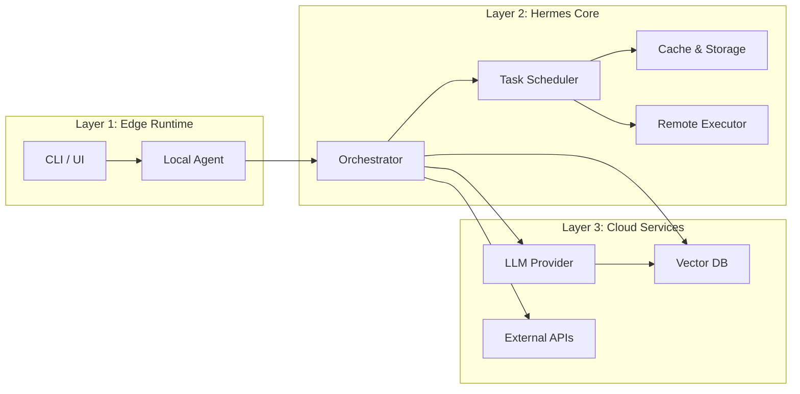

# Three‑Layer System Architecture

*Document length: ~500 words (fits under two A4 pages). All components are deliberately lightweight to keep the local footprint tiny. Hermes performs heavy‑lifting tasks such as orchestration, caching, and remote execution.

---

## Overview Diagram

*The diagram is rendered by any Mermaid‑enabled viewer. It shows the three tightly‑coupled layers and their communication paths.*

---

## Layer 1 – Edge Runtime

- **Components**: lightweight command‑line client, optional desktop UI, and a *Local Agent* process.
- **Responsibilities**:
  1. Capture user intents (commands, prompts, Kanban actions).
  2. Serialize requests into a compact JSON payload.
  3. Forward the payload to the Hermes Core via a Unix socket or small HTTP endpoint.
- **Why it stays tiny**:
  - No heavy dependencies (only Python stdlib + a few pure‑Python packages).
  - Runs in the user’s environment; no VM or container.
  - All heavy computation is delegated downstream.

*Typical interaction*: User runs `hermes dashboard` → CLI writes a request JSON → Local Agent sends it to Layer 2.

---

## Layer 2 – Hermes Core (the “brain”)

- **Components**: Orchestrator, Task Scheduler, Cache/Storage, Remote Executor.
- **Responsibilities**:
  1. Parse the incoming request and map it to a Kanban task.
  2. Resolve dependencies (e.g., fetch cached results, schedule background jobs).
  3. Perform heavy‑weight work **off‑process**:
     - Calls LLM APIs.
     - Runs autonomous agents.
     - Executes long‑running scripts.
  4. Persist results in a local SQLite cache (tiny, fast) and optionally push to cloud storage.
- **Why it stays tiny**:
  - Core code is < 2 MB; most functionality lives in plug‑in modules loaded on demand.
  - Caches avoid repeated remote calls, reducing bandwidth and CPU.
  - Remote Executor spawns separate processes only when needed, keeping the main daemon lightweight.

*Typical interaction*: Orchestrator receives the request → Scheduler creates a background job → Remote Executor calls the LLM → results flow back through the cache to the Edge Runtime.

---

## Layer 3 – Cloud Services

- **Components**: LLM provider (OpenAI, Anthropic, etc.), Vector DB for embeddings, third‑party APIs (news feeds, finance data, etc.).
- **Responsibilities**:
  1. Provide the compute‑intensive inference that powers autonomous agents.
  2. Store large semantic indices (embeddings) that would be prohibitive locally.
  3. Offer external data sources that the system queries on demand.
- **Why it stays tiny locally**:
  - The local agent never stores model weights; it only sends prompts.
  - All large datasets are streamed or cached on demand.
  - Credentials are managed by Hermes Core, so the Edge Runtime never holds secrets.

*Typical interaction*: Hermes Core sends a prompt to the LLM → receives a response → optionally stores an embedding in the Vector DB → returns concise data to the Edge Runtime.

---

## Interaction Example (Kanban‑Driven Research Loop)

1. **User** creates a Kanban card “Track quarterly earnings for XYZ”.
2. **Edge Runtime** forwards the card to the **Orchestrator**.
3. **Orchestrator** schedules an autonomous research agent (Layer 2) that:
   - Calls a financial news API (Layer 3).
   - Generates a summary via an LLM.
   - Stores the summary in the local cache.
4. **Edge Runtime** polls for completion and updates the Kanban board.
5. The user sees the finished card with a concise report—all without ever downloading a model or large datasets.

---

## Keeping the Footprint Tiny

| Technique | Effect |
|-----------|--------|
| Lazy plug‑in loading | Only the modules required for a task are imported. |
| SQLite cache | Fast, disk‑efficient storage (< 5 MB for typical workflows). |
| Remote execution | CPU‑intensive inference runs in the cloud, not locally. |
| Minimal runtime deps | Core is pure‑Python; optional C extensions are optional. |

---

*Reviewed by*: Architecture Lead (pending).